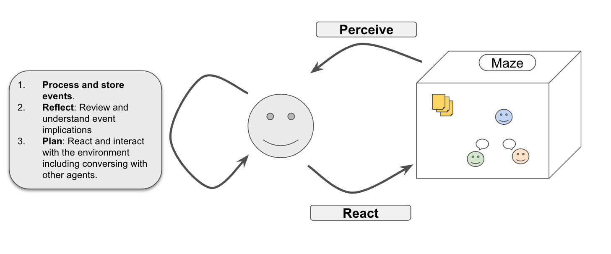

# Exploring Simulacra: A Series on Generative Agents

This is the repository accompanying the [tutorial series](https://www.pgupta.info/teaching/tutorials) dedicated to exploring the generative agents of Simulacra. This repository offers a simplified version of the [original Simulacra code](https://github.com/joonspk-research/generative_agents). For an introduction and overview of the tutorials and simulation design, consider starting with this [blog post](https://www.pgupta.info/blog/2024/simulacra-0/).



## Getting Started

### Prerequisites

- **OpenAI Python Library**: Required to interact with LLMs. This tutorial uses GPT via AzureOpenAI Studio, though the prompt function is adaptable for use with other LLMs.
- **Access to the Original Repository**: Necessary for the environment and agent persona descriptions. If not already cloned, use:

    ```bash
    git clone https://github.com/joonspk-research/generative_agents.git
    ```

    Then, copy the required files into your working directory:

    ```bash
    cp ./generative_agents/reverie/backend_server/maze.py .
    cp ./generative_agents/reverie/backend_server/global_methods.py .
    cp ./generative_agents/reverie/backend_server/utils.py .
    ```

### Running the Simulation

Execute the simulation with the following command:

```bash
python main.py
```

### Understanding the Output

The simulation generates various logs for a comprehensive analysis:

- **prompts_log.txt**: Chronicles all simulation prompts and their responses.
- **failsafe_logs.txt**: Details instances of prompt failures.
- **schedule_logfile.txt**: Offers insights into agent scheduling and planning.
- **sim_logs.txt**: Tracks agent movements within the simulation.


